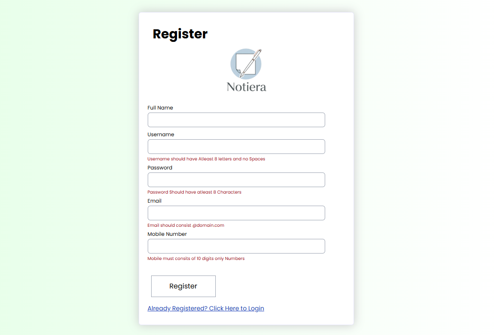
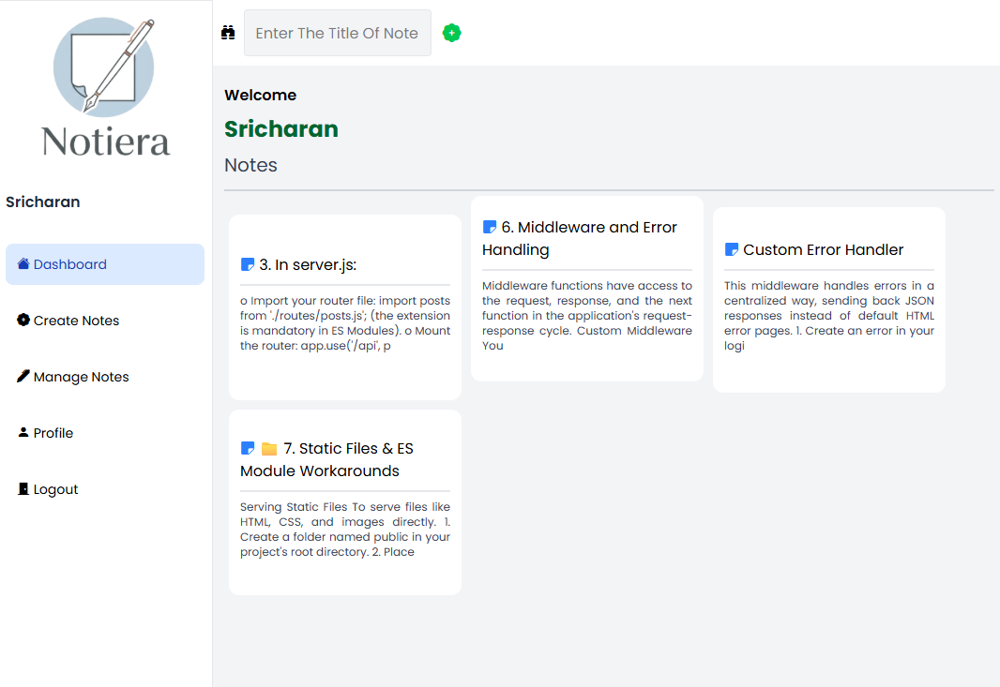
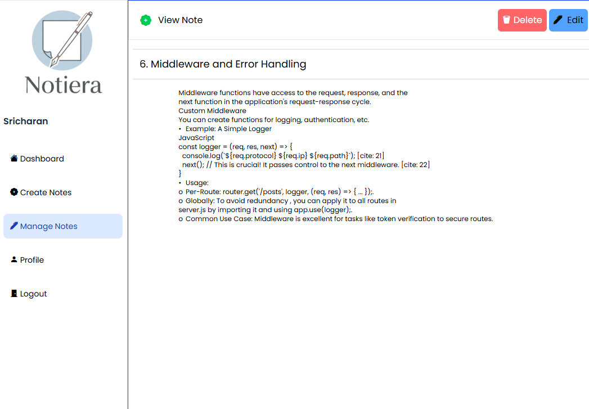
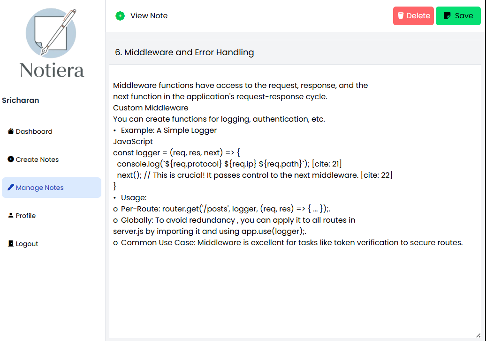
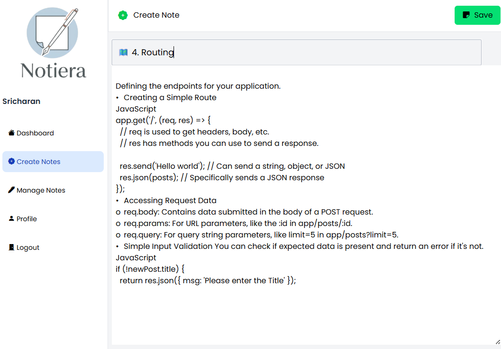
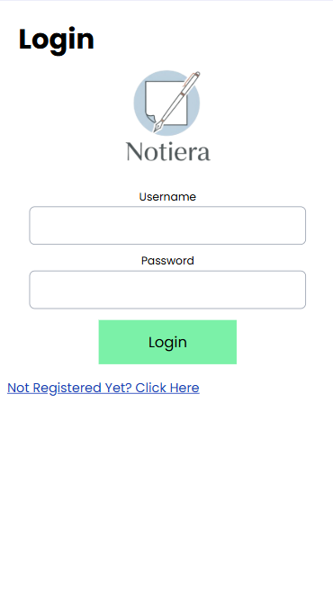
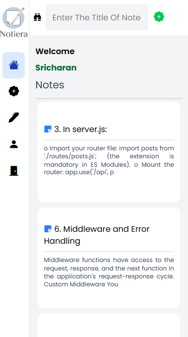
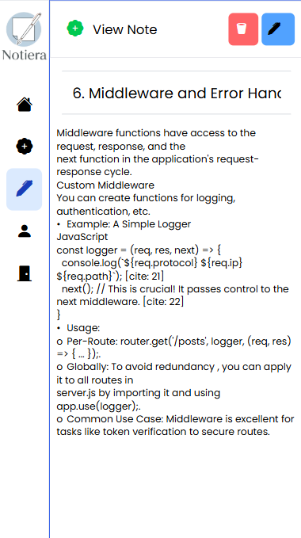
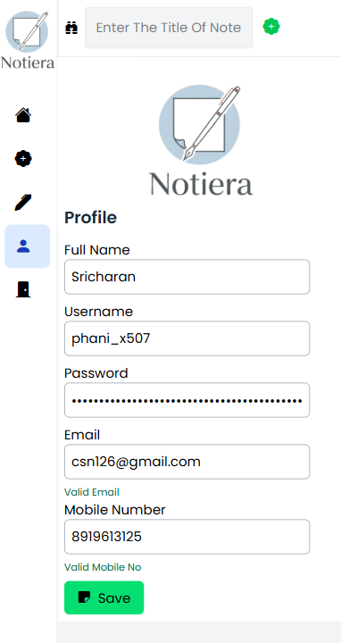
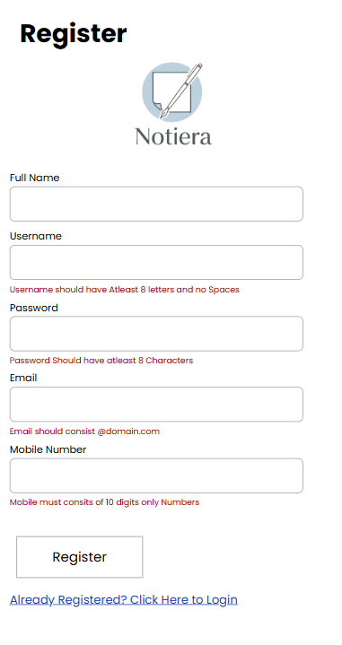

# NotiEra

NotiEra is a full-stack note-taking application designed for simplicity, speed, and security. It allows users to create, edit, view, and manage notes with a modern UI and robust backend. Built with Node.js, Express, MongoDB, and React (Vite), NotiEra is ideal for personal productivity and collaborative note management.

---

## Features

- **User Authentication**: Secure registration and login system
- **Create, Edit, Delete Notes**: Full CRUD operations for notes
- **User Profile Management**: Update and view user details
- **Responsive UI**: Modern, mobile-friendly interface
- **Error Handling**: Centralized error management for backend APIs
- **Logging & Middleware**: Request logging and authentication middleware
- **Demo Data**: Sample notes and users for testing

---


## Tech Stack

- **Frontend**: React (Vite), Tailwind CSS, CSS
- **Backend**: Node.js, Express
- **Database**: MongoDB
- **Other**: JWT for authentication, ESLint for code quality

---

## Project Structure

```
NotiEra/
├── Backend/
│   ├── server.js
│   ├── package.json
│   ├── config/
│   ├── controllers/
│   ├── data/
│   ├── ErrorHandler/
│   ├── middleware/
│   └── routes/
└── FrontEnd/
    ├── notiera-frontend/
    │   ├── src/
    │   ├── public/
    │   ├── package.json
    │   └── vite.config.js
    ├── src/
    ├── public/
    ├── package.json
    └── vite.config.js
```

---

## Getting Started

### Prerequisites
- Node.js (v16+)
- npm
- MongoDB (local or Atlas)

### Backend Setup
1. Navigate to the `Backend` folder:
   ```powershell
   cd Backend
   ```
2. Install dependencies:
   ```powershell
   npm install
   ```
3. Configure environment variables in `.env` (MongoDB URI, JWT secret, etc.)
4. Start the server:
   ```powershell
   node server.js
   ```


### Frontend Setup
1. Navigate to the frontend folder:
   ```powershell
   cd FrontEnd/notiera-frontend
   ```
2. Install dependencies:
   ```powershell
   npm install
   ```
3. Install Tailwind CSS and its dependencies:
   ```powershell
   npm install -D tailwindcss postcss autoprefixer
   npx tailwindcss init -p
   ```
4. Configure Tailwind in `tailwind.config.js` and add Tailwind directives to your main CSS file (see [Tailwind docs](https://tailwindcss.com/docs/installation)).
5. Start the development server:
   ```powershell
   npm run dev
   ```
6. Open [http://localhost:5173](http://localhost:5173) in your browser.

---

## API Endpoints

- **Auth**: `/api/auth/register`, `/api/auth/login`
- **Notes**: `/api/notes` (GET, POST, PUT, DELETE)
- **User**: `/api/user/profile`

See `Backend/routes/router.js` for full details.

---

## Error Handling
Centralized error handling is implemented in `Backend/ErrorHandler/MainErrorHandler.js` for consistent API responses.

---

## Contributing

1. Fork the repository
2. Create your feature branch (`git checkout -b feature/YourFeature`)
3. Commit your changes (`git commit -am 'Add new feature'`)
4. Push to the branch (`git push origin feature/YourFeature`)
5. Open a Pull Request

---

## License

This project is licensed under the MIT License.

---

## Maintainers
- [phani-x507](https://github.com/phani-x507)

---


## Screenshots

### Desktop Views






### Mobile Views






---


## Acknowledgements
- React
- Vite
- Tailwind CSS
- Node.js
- Express
- MongoDB
- JWT

---
